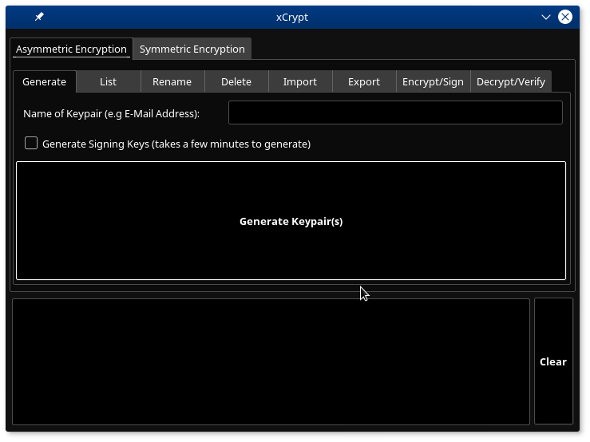

# xcrypt
Post-Quantum Crypto GUI for codecrypt under Linux

This Python3 script allows you to control the Post-Quantum-Cryptpgraphy Tool "codecrypt" with a graphical user interface.
You need to have the following dependencies installed:
- codecrypt
- python3
- python3-pyqt5

Simply run this script (no root permissions needed). If you are using Debian 64-bit, you can use the "xcrypt_3.0-1_amd64.deb" package to install it on your system.

Screenshot:

